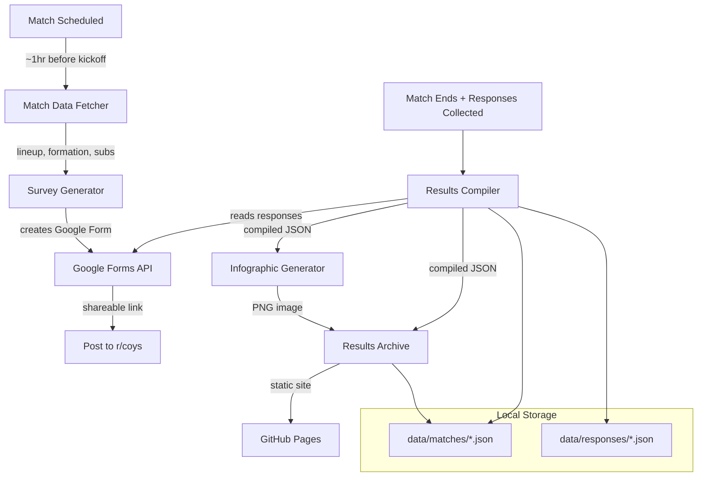

# Design Document: Spurs Survey Automation

## Overview

This system automates the end-to-end workflow of creating post-match player rating surveys for r/coys, compiling results, generating infographics, and hosting a browsable archive. It is built as a Python CLI application with a static website for the results archive.

The system is composed of four main components:
1. **Match Data Fetcher** — retrieves lineups, formations, substitutions, and match metadata from the free football-data.org API
2. **Survey Generator** — creates Google Forms surveys via the Google Forms API and compiles responses
3. **Infographic Generator** — renders a 16:9 results image using Pillow (PIL)
4. **Results Archive** — a static site (GitHub Pages) built from JSON data files, with filtering and shareable URLs

### Key Technical Decisions

- **Language**: Python 3.11+ — the user already has Python scripts in the workspace, and Python has strong libraries for image generation (Pillow), API interaction (requests), and data processing (pandas/numpy)
- **Football Data API**: [football-data.org](https://www.football-data.org/) — free tier provides lineups, formations, substitutions, scores, and match metadata for the Premier League and major competitions. Alternative: API-Football (free tier with 100 requests/day)
- **Survey Platform**: Google Forms via the Google Forms API (free, user already uses Google Forms)
- **Image Generation**: Pillow (PIL) — no external dependencies, produces PNG output directly
- **Results Archive**: Static site hosted on GitHub Pages (free), built with simple HTML/JS that reads JSON data files
- **Storage**: JSON files in a local `data/` directory, committed to the repository

## Architecture



### CLI Commands

The system exposes a single CLI entry point with subcommands:

```
spurs-survey fetch <match_id>        # Fetch match data from API
spurs-survey create-survey <match_id> # Generate Google Form from match data
spurs-survey compile <match_id>       # Compile survey responses into results
spurs-survey infographic <match_id>   # Generate results infographic PNG
spurs-survey build-site               # Rebuild the static results archive
spurs-survey run <match_id>           # Run full pipeline: fetch → create → (wait) → compile → infographic → build
```

## Components and Interfaces

### 1. Match Data Fetcher (`match_data.py`)

Responsible for calling the football-data.org API and returning structured match data.

```python
def fetch_match_data(match_id: int) -> MatchData:
    """Fetch lineup, formation, subs, and metadata for a Tottenham match."""
    ...

def map_player_images(players: list[str], image_dir: str) -> dict[str, str]:
    """Map player names to local image filenames using fuzzy matching."""
    ...
```

The fetcher uses fuzzy string matching (via `thefuzz` library) to map API player names to local image filenames, since naming conventions may differ (e.g., "Heung-Min Son" vs "son_heungmin.png").

**Fallback**: If the API is unavailable or data is incomplete, the CLI prompts the user to enter missing fields manually via stdin.

### 2. Survey Generator (`survey.py`)

Creates Google Forms surveys and compiles responses.

```python
def create_survey(match_data: MatchData) -> str:
    """Create a Google Form survey and return the shareable link."""
    ...

def compile_responses(match_id: int) -> CompiledResults:
    """Fetch responses from Google Forms API and compute statistics."""
    ...
```

Uses the Google Forms API (v1) with a service account for authentication. The form is created programmatically with the exact section order and rating scale defined in the requirements.

### 3. Infographic Generator (`infographic.py`)

Renders the results image using Pillow.

```python
def generate_infographic(
    results: CompiledResults,
    quote_of_match: str,
    photo_of_match_path: str,
    output_path: str
) -> str:
    """Generate a 16:9 PNG infographic and return the output file path."""
    ...
```

The generator uses a coordinate-based layout system. Formation rows are mapped to Y-positions, and players within each row are evenly spaced horizontally. The three-column layout is achieved by dividing the canvas into percentage-based regions.

### 4. Results Archive (`archive/`)

A static site that reads JSON data files and renders match results.

```
archive/
├── index.html          # Match list with filtering
├── match.html          # Individual match result page
├── js/
│   └── app.js          # Client-side filtering and rendering
├── css/
│   └── style.css       # Styling
├── data/
│   └── matches.json    # Index of all matches
└── matches/
    ├── <match_id>/
    │   ├── results.json
    │   └── infographic.png
    └── ...
```

The site is pure HTML/CSS/JS with no build step. `matches.json` is an index file listing all matches with metadata for filtering. Each match directory contains the compiled results JSON and the infographic PNG.

## Data Models

### MatchData

```python
@dataclass
class PlayerInfo:
    name: str
    position: str           # e.g., "GK", "CB", "CM", "LW"
    image_path: str | None  # Local path to player image, None if not found
    shirt_number: int | None

@dataclass
class SubstitutionEvent:
    player_in: str          # Name of substitute player
    player_out: str         # Name of replaced player
    minute: int

@dataclass
class MatchData:
    match_id: int
    home_team: str
    away_team: str
    home_score: int | None          # None before match ends
    away_score: int | None
    competition: str                # e.g., "Premier League", "EFL Cup"
    matchday: str                   # e.g., "Week 5", "Round 4"
    date: str                       # ISO 8601 date
    venue: str
    formation: str                  # e.g., "4-3-3"
    coach: str
    starting_players: list[PlayerInfo]
    substitutions: list[SubstitutionEvent]
    is_tottenham_home: bool
```

### CompiledResults

```python
@dataclass
class RatingStats:
    mean: float
    std_dev: float

@dataclass
class PlayerRating:
    name: str
    position: str
    image_path: str | None
    rating: RatingStats
    is_starter: bool
    goals: int              # From match events
    assists: int
    own_goals: int
    is_motm: bool

@dataclass
class CompiledResults:
    match_id: int
    match_metadata: MatchMetadata
    team_rating: RatingStats
    opponent_rating: RatingStats
    referee_rating: RatingStats
    coach_ratings: CoachRatings
    overall_rating: float           # Mean of all player ratings
    starting_player_ratings: list[PlayerRating]
    substitute_player_ratings: list[PlayerRating]
    motm_winners: list[str]         # One or more names (ties possible)
    total_responses: int
    formation: str

@dataclass
class MatchMetadata:
    opponent: str
    competition: str
    matchday: str
    date: str
    venue: str
    home_score: int
    away_score: int
    is_tottenham_home: bool

@dataclass
class CoachRatings:
    name: str
    starting_eleven: RatingStats
    on_field_tactics: RatingStats
    substitutions: RatingStats
```

### Formation Layout Mapping

Formations are mapped to row configurations for the infographic:

```python
FORMATION_LAYOUTS: dict[str, list[tuple[str, int]]] = {
    "4-3-3": [("FW", 3), ("MF", 3), ("DF", 4), ("GK", 1)],
    "4-4-2": [("FW", 2), ("MF", 4), ("DF", 4), ("GK", 1)],
    "3-5-2": [("FW", 2), ("MF", 5), ("DF", 3), ("GK", 1)],
    "4-2-3-1": [("FW", 1), ("AM", 3), ("DM", 2), ("DF", 4), ("GK", 1)],
    "3-4-3": [("FW", 3), ("MF", 4), ("DF", 3), ("GK", 1)],
    "5-3-2": [("FW", 2), ("MF", 3), ("DF", 5), ("GK", 1)],
    "4-1-4-1": [("FW", 1), ("MF", 4), ("DM", 1), ("DF", 4), ("GK", 1)],
}
```

### JSON Serialization Format

Match results are stored as JSON files. Example structure:

```json
{
  "match_id": 12345,
  "metadata": {
    "opponent": "Newcastle",
    "competition": "Premier League",
    "matchday": "Week 3",
    "date": "2024-09-01",
    "venue": "St. James Park",
    "home_score": 1,
    "away_score": 2,
    "is_tottenham_home": false
  },
  "formation": "4-3-3",
  "team_rating": { "mean": 5.5, "std_dev": 1.2 },
  "opponent_rating": { "mean": 5.4, "std_dev": 1.1 },
  "referee_rating": { "mean": 6.5, "std_dev": 1.3 },
  "coach_ratings": {
    "name": "Postecoglou",
    "starting_eleven": { "mean": 6.5, "std_dev": 1.4 },
    "on_field_tactics": { "mean": 6.1, "std_dev": 1.5 },
    "substitutions": { "mean": 5.8, "std_dev": 1.6 }
  },
  "overall_rating": 5.9,
  "starting_players": [
    {
      "name": "Vicario",
      "position": "GK",
      "image_path": "cropped images/guglielmo_vicario.png",
      "rating": { "mean": 6.2, "std_dev": 1.4 },
      "goals": 0,
      "assists": 0,
      "own_goals": 0,
      "is_motm": false
    }
  ],
  "substitute_players": [],
  "motm_winners": ["Johnson"],
  "total_responses": 309
}
```


## Correctness Properties

*A property is a characteristic or behavior that should hold true across all valid executions of a system — essentially, a formal statement about what the system should do. Properties serve as the bridge between human-readable specifications and machine-verifiable correctness guarantees.*

### Property 1: API Response Parsing Extracts All Required Fields

*For any* valid football-data.org API response containing match data, parsing the response SHALL produce a MatchData object where the starting_players list has exactly 11 entries, the formation is a non-empty string, the coach name is non-empty, and all MatchMetadata fields (opponent, competition, matchday, date) are populated.

**Validates: Requirements 1.1, 1.3, 1.5**

### Property 2: Player Image Fuzzy Matching Returns Valid Results

*For any* player name and any non-empty set of image filenames, the image mapper SHALL return either a filename that exists in the provided set or None — it SHALL never return a filename not in the set.

**Validates: Requirements 1.2**

### Property 3: Missing Field Detection Is Complete

*For any* API response with a subset of required fields removed, the missing field detector SHALL report exactly the set of fields that were removed — no more, no fewer.

**Validates: Requirements 1.4**

### Property 4: Survey Structure and Section Ordering

*For any* valid MatchData with at least one substitution, the generated survey structure SHALL contain sections in exactly this order: rating scale description, team rating, opponent rating, coach ratings (3 items), referee rating, starting player ratings (one per starter), substitute player ratings (one per sub), and Man_of_the_Match vote. All rating questions SHALL use the 0–10 integer scale.

**Validates: Requirements 2.1, 2.2**

### Property 5: Man of the Match Options Completeness

*For any* valid MatchData, the Man_of_the_Match question options SHALL be exactly the union of all starting player names and all substitute player names, with no duplicates and no missing players.

**Validates: Requirements 2.3**

### Property 6: Statistics Computation Correctness

*For any* list of integer ratings in the range [0, 10] with at least one entry, the computed mean SHALL equal the arithmetic mean of the list, and the computed standard deviation SHALL equal the population standard deviation of the list. The overall rating SHALL equal the mean of all individual player rating means. The total response count SHALL equal the number of response records.

**Validates: Requirements 3.1, 3.4, 3.5**

### Property 7: Man of the Match Winner Determination

*For any* list of Man_of_the_Match votes, the reported winners SHALL be exactly the set of players whose vote count equals the maximum vote count in the list. If one player has the most votes, the winners list has one entry. If N players tie for the most votes, the winners list has N entries.

**Validates: Requirements 3.2, 3.3**

### Property 8: JSON Serialization Round-Trip

*For any* valid CompiledResults object, serializing to JSON and then deserializing back SHALL produce a CompiledResults object that is equivalent to the original (all fields match, including nested objects and lists).

**Validates: Requirements 6.1, 6.2, 6.3**

### Property 9: Infographic Output Dimensions

*For any* valid CompiledResults, the generated infographic image SHALL have a 16:9 aspect ratio (width:height).

**Validates: Requirements 4.1**

### Property 10: Formation Layout Produces Correct Player Count

*For any* valid formation string in the supported set, the formation layout mapping SHALL produce rows whose player counts sum to exactly 11 (10 outfield players + 1 goalkeeper).

**Validates: Requirements 4.3**

### Property 11: Missing Player Images Do Not Cause Failures

*For any* valid CompiledResults where one or more players have a None image_path, the infographic generator SHALL produce a valid PNG image without raising an exception.

**Validates: Requirements 4.9**

### Property 12: Archive Match Sorting

*For any* list of match results with distinct dates, the archive listing SHALL return matches sorted by date in descending order (most recent first).

**Validates: Requirements 5.1**

### Property 13: Archive Filtering Correctness

*For any* list of match results and any combination of filter criteria (opponent name, competition name, date range), every match in the filtered results SHALL satisfy all specified filter conditions, and no match satisfying all conditions SHALL be excluded.

**Validates: Requirements 5.3**

## Error Handling

| Scenario | Behavior |
|---|---|
| Football API unavailable | Log error, prompt user for manual data entry via CLI |
| Football API returns partial data | Identify missing fields, prompt user to fill gaps |
| Google Forms API auth failure | Log error with instructions to refresh credentials |
| Google Forms API rate limit | Retry with exponential backoff (max 3 retries) |
| Player name has no fuzzy match above threshold | Set image_path to None, log warning |
| Invalid formation string | Fall back to a flat list layout, log warning |
| Survey has zero responses | Skip compilation, log warning |
| Image file corrupted or unreadable | Use placeholder silhouette, log warning |
| JSON deserialization fails | Log error with file path, skip that match in archive |

## Testing Strategy

### Property-Based Testing

- **Library**: [Hypothesis](https://hypothesis.readthedocs.io/) for Python
- **Minimum iterations**: 100 per property test
- **Tag format**: `# Feature: spurs-survey-automation, Property N: <property_text>`

Each correctness property (Properties 1–13) maps to a single Hypothesis property-based test. Generators will produce:
- Random valid API response payloads (for Properties 1, 3)
- Random player name / filename pairs (for Property 2)
- Random MatchData objects with varying lineup sizes and substitution counts (for Properties 4, 5)
- Random lists of 0–10 integer ratings (for Properties 6, 7)
- Random CompiledResults objects (for Properties 8, 9, 10, 11)
- Random lists of match results with metadata (for Properties 12, 13)

### Unit Testing

- **Library**: pytest
- Unit tests complement property tests by covering:
  - Specific known match data examples (e.g., a real Spurs vs Newcastle match)
  - Edge cases: zero substitutions, all players tied for MOTM, single response
  - Google Forms API mock integration tests
  - Infographic visual spot-checks (verify image is valid PNG, correct dimensions)
  - Archive URL generation for specific match IDs

### Test Organization

```
tests/
├── test_match_data.py       # Properties 1, 2, 3 + unit tests
├── test_survey.py           # Properties 4, 5 + unit tests
├── test_results.py          # Properties 6, 7, 8 + unit tests
├── test_infographic.py      # Properties 9, 10, 11 + unit tests
└── test_archive.py          # Properties 12, 13 + unit tests
```
